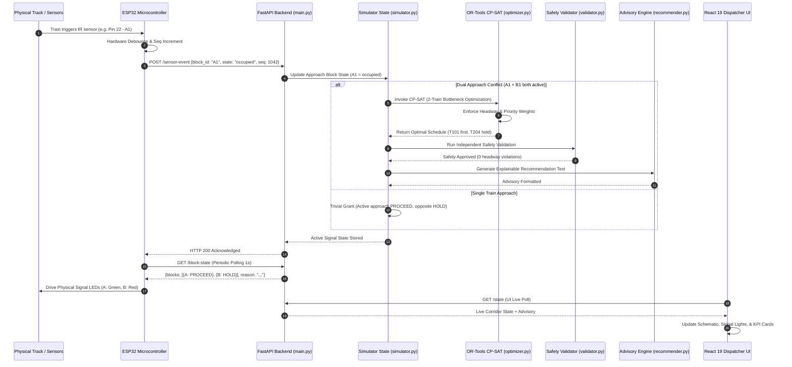

# AI-Powered Precise Train Traffic Control — SIH25022
## End-to-End Workflow & Hardware Integration

---

### 1. Step-by-Step System Workflow

The diagram below outlines the full lifecycle of an event moving through physical sensors, the software decision stack, and back to physical optical signals.



---

### 2. Physical-to-Digital Event Mapping Table

| Step | Trigger Source | Component | Action / Processing | Output |
| :---: | :--- | :--- | :--- | :--- |
| **1** | Track Motion | Physical IR Sensor | Detects train passage at boundary $A_1$ or $B_1$. | Digital LOW/HIGH on GPIO pin. |
| **2** | Microcontroller | ESP32 Firmware | Debounces signal ($50\text{ ms}$) and increments `seq`. | JSON payload over HTTP POST. |
| **3** | Ingestion Layer | FastAPI [`main.py`](file:///c:/Users/Sri/OneDrive/Desktop/friday_traintraffic/prototype-demo/backend/main.py) | Validates payload against Pydantic schema; checks sequence order. | `200 OK` + Internal event dispatch. |
| **4** | Simulation State | [`simulator.py`](file:///c:/Users/Sri/OneDrive/Desktop/friday_traintraffic/prototype-demo/backend/simulator.py) | Updates track block state table; evaluates conflict conditions. | State flag: `CONFLICT_DETECTED` / `CLEAR`. |
| **5** | Optimization Engine | [`optimizer.py`](file:///c:/Users/Sri/OneDrive/Desktop/friday_traintraffic/prototype-demo/backend/optimizer.py) | CP-SAT solver computes minimal weighted delay schedule. | Optimal entry & dwell timetable. |
| **6** | Safety Validator | [`validator.py`](file:///c:/Users/Sri/OneDrive/Desktop/friday_traintraffic/prototype-demo/backend/validator.py) | Checks minimum headway ($\ge 3\text{ min}$) & block possession. | Validation summary (Pass/Fail). |
| **7** | Explainability Engine | [`recommender.py`](file:///c:/Users/Sri/OneDrive/Desktop/friday_traintraffic/prototype-demo/backend/recommender.py) | Generates plain-language reason for the dispatcher. | Human-readable advisory string. |
| **8** | Hardware Feedback | ESP32 `GET /block-state` | Retrieves updated signal decisions. | Signal states (`PROCEED` / `HOLD`). |
| **9** | Physical Actuation | Optical LED Signals | Switches physical LEDs on the junction board. | Physical Green / Red lights. |
| **10**| Dispatcher UI | React Dashboard | Reflects live track layout, signal aspects, KPIs, and advice. | Live visual updates on screen. |

---

### 3. Division of Responsibility Between Hardware & Software

```
+------------------------------------+------------------------------------+
|       Hardware Workstream          |        Software Workstream         |
+------------------------------------+------------------------------------+
| 1. Physical track junction board.  | 1. FastAPI backend architecture.   |
| 2. IR sensors & optical LED wiring.| 2. Google OR-Tools CP-SAT model.   |
| 3. ESP32 firmware & debounce logic.| 3. Safety validation engine.       |
| 4. WiFi client & HTTP polling loop.| 4. Explainable recommendation text.|
| 5. Failsafe local rule (standalone)| 5. React 19 Dispatcher Dashboard.  |
+------------------------------------+------------------------------------+
```

---

### 4. Judge-Facing Demo Narrative & Script

When presenting the live demonstration to hackathon judges, use this concise, unified framing:

> *"Our physical junction board detects approaching trains via optical sensors and transmits real-time occupancy events to our software decision engine.*  
> 
> *Instead of relying on a rigid, local first-come-first-served rule that ignores passenger priorities and corridor-level impacts, our system feeds the live conflict into a Google OR-Tools CP-SAT optimization model.*  
> 
> *The AI solver minimizes weighted network delay, independently validates all safety and headway constraints, and outputs both an explainable advisory for the human dispatcher and direct signal commands back to the physical junction LEDs.*  
> 
> *The dispatcher remains in full control at all times, with complete visibility across both the physical model and the digital corridor."*
