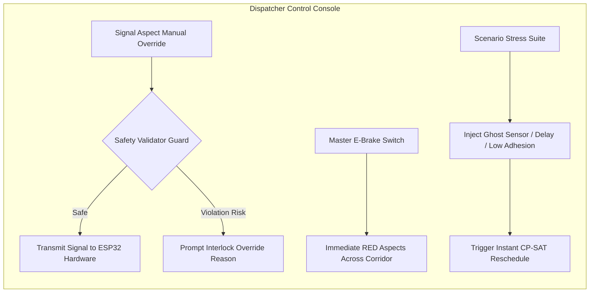
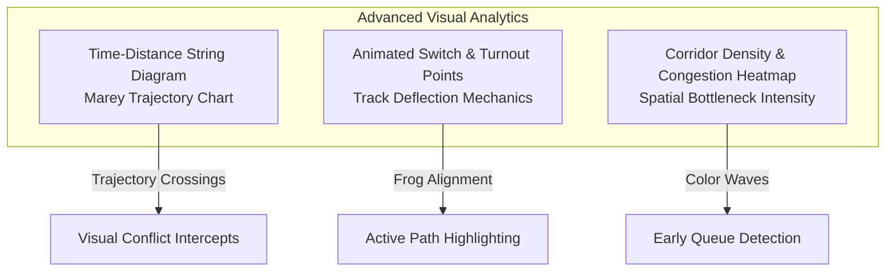
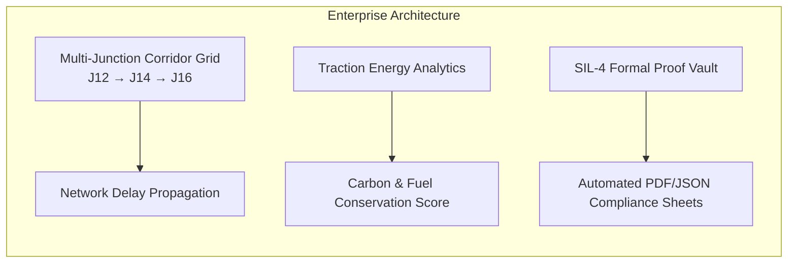

# RailGuard AI — Detailed UI Mindmap & Component Planning Guide

**Document Version:** 2.0.0  
**Project:** AI-Powered Precise Train Traffic Control (SIH25022)  
**Target Audience:** UI/UX Designers, Frontend Engineers, Dispatcher Systems Architects

---

## 1. Master System Mindmap

```mermaid
mindmap
  root((RailGuard AI<br/>Control Console))
    (1) Current Production Baseline
      [Live Corridor & Simulation]
        SVG Track Schematic (Junction 14)
        Dynamic Train Kinematics (Express vs Freight)
        Luminous LED Signal Lamps (SIG-A, SIG-B)
        GPIO Sensor Trigger Pulse Rings
        Real-Time Telemetry Stream
        Software Replay Actions (R1–R5)
      [Advisory Recommendation Panel]
        PROCEED / HOLD Status Tiles
        Confidence Score Meter (94%)
        Human-in-the-Loop Safeguard Notice
      [Decision Core]
        Case 2 vs Case 3 Interactive Toggle
        Passenger-Weighted Delay Bars
        7-Stage Verification Pipeline
        5 Active CP-SAT Safety Constraints
        Independent Validator Verdict (6/6 PASS)
      [ML ETA Forecast]
        Kinematic Baseline vs ML Regressor
        Non-Linear Braking Variance Pills
        Numerical Count-Up Displays
      [KPI Performance Dashboard]
        Delay, Conflicts, Punctuality, Solver Time
    (2) Layer 1: Decision Explanation
      [Priority Class Matrix]
        Class 1: Express (Weight 1.0)
        Class 2: Passenger (Weight 2.0)
        Class 3: Freight (Weight 3.0)
      [Cost Weight Penalty Engine]
        Passenger-Minute Penalty
        Downstream Cascade Penalty
        Platform Connection Guarantee
      [Explainability Inspector Modal]
        Mathematical Solver Rationale
        Counterfactual "What-If" Diff
        Safety Margin & Constraint Slack
    (3) Layer 2: User Interaction & Dispatcher Controls
      [Manual Signal Override Deck]
        Per-Approach Signal Aspect Toggles
        Safety Interlock Confirmation Modal
      [Emergency Operations]
        Master E-Brake (Corridor All-Stop)
        Speed Restriction Slider (TSR)
      [Scenario Stress Injection]
        Ghost Sensor Fault Trigger
        Delayed Station Departure Trigger
        Wet Rail / Low Adhesion Trigger
      [Audit & Dispatcher Log]
        Advisory Acceptance Ledger
        Manual Override Rationale Entry
    (4) Layer 3: Advanced Visualization Suite
      [Time-Distance Marey Diagram]
        Trajectory Slopes (Speed Profile)
        Junction Conflict Diamond
        Headway Separation Buffers
      [Dynamic Track Topologies]
        Switch Points & Turnout Deflection
        Loop Sidings & Overtake Tracks
      [Congestion Heatmaps]
        Block Occupancy Density Wave
        Signal Aspect Radiant Transitions
    (5) Layer 4: Scalability & Enterprise Extensions
      [Multi-Junction Corridor Grid]
        Cascading Junctions (J12 → J14 → J16)
        Network Delay Propagation Model
      [Green Corridor & Energy Analytics]
        Freight Kinetic Energy Conservation
        Regenerative Braking Yield
      [Compliance & Safety Auditing]
        SIL-4 Formal Safety Proof Exporter
        Black-Box Incident Replay Vault
```

---

## 2. Inventory: Existing Production Components

| Component | UI Location | Key Elements |
| :--- | :--- | :--- |
| **Live Corridor Schematic** | [`src/components/Corridor.jsx`](file:///c:/Users/Sri/OneDrive/Desktop/friday_traintraffic/prototype-demo/src/components/Corridor.jsx) | High-precision SVG rail geometry, dynamic gliding train sprites, optical LED glow bloom filters (`#greenGlow`, `#redGlow`), GPIO sensor trigger pulse rings, sleeper flow animation. |
| **Signal & Replay Monitor** | [`src/components/LiveJunction.jsx`](file:///c:/Users/Sri/OneDrive/Desktop/friday_traintraffic/prototype-demo/src/components/LiveJunction.jsx) | Approach A/B signal head status cards, live monotonic sensor event feed, and 5 interactive software replay buttons (R1–R5). |
| **Decision Core & Comparison** | [`src/components/DecisionCore.jsx`](file:///c:/Users/Sri/OneDrive/Desktop/friday_traintraffic/prototype-demo/src/components/DecisionCore.jsx) | **Interactive Case 2 vs. Case 3 Toggle** (Legacy FCFS vs. CP-SAT priority scheduling), animated delay reduction bars, 7-stage deterministic verification cascade, 5 active constraints, 6/6 independent safety checks. |
| **ML ETA Forecast** | [`src/components/EtaForecast.jsx`](file:///c:/Users/Sri/OneDrive/Desktop/friday_traintraffic/prototype-demo/src/components/EtaForecast.jsx) | Side-by-side comparison of Kinematic physics ETA vs Gradient Boosted ML ETA with count-up animations and non-linear braking variance chips. |
| **Overview & KPIs** | [`src/components/Overview.jsx`](file:///c:/Users/Sri/OneDrive/Desktop/friday_traintraffic/prototype-demo/src/components/Overview.jsx) | Apple-grade hero typography with ambient backdrop glow orb, CP-SAT solve time badge (11.8ms), 4 live KPI counters with tabular numbers. |

---

## 3. Expansion Layer 1: Decision Explanation (The "Why" Engine)

The goal of this layer is to make the solver's algorithmic choices 100% explainable, transparent, and auditable for dispatchers and railway inspectors.

```mermaid
graph TD
    subgraph Inputs["Decision Inputs"]
        P[Train Priority Hierarchy<br/>Express=1 | Passenger=2 | Freight=3]
        D[Distance & Speed Telemetry<br/>ML ETA Forecast]
        C[Safety Constraints<br/>Exclusive Block | ≥90s Headway]
    end

    subgraph Engine["CP-SAT Cost Function"]
        COST["Objective = Minimize ∑ (w_i × delay_i) + Penalty(headway_violation)"]
    end

    subgraph UI_Outputs["UI Explanation Modules"]
        M1[Interactive Priority Weight Matrix]
        M2[Temporal Headway Gantt Buffer]
        M3[Explainability Drawer: Why Train B Holds for Train A]
        M4[Constraint Slack Tolerances]
    end

    Inputs --> Engine
    Engine --> UI_Outputs
```

### Planned UI Components:
1. **Interactive Priority Matrix (Weight Sliders)**:
   * Real-time sliders allowing dispatchers to adjust penalty multipliers ($w_{\text{express}}, w_{\text{passenger}}, w_{\text{freight}}$).
   * Live preview demonstrating how shifting weights would alter the recommended arrival sequence.
2. **Explainability Drawer / Modal**:
   * One-click trigger next to recommendations showing:
     * **Direct Rule:** Express arrives 38s earlier and carries $3\times$ passenger weight.
     * **Downstream Impact:** Holding Express causes 4 cascade delays at downstream junctions; holding Freight causes 0.
     * **Headway Margin:** Freight fits into the succeeding 210-second gap without causing line congestion.
3. **Constraint Slack Meters**:
   * Circular or linear tolerance gauges showing current schedule proximity to safety thresholds (e.g., Headway: $124\text{s} / 90\text{s minimum}$, Block Clear Time: $46\text{s} / 30\text{s minimum}$).

---

## 4. Expansion Layer 2: User Interaction & Dispatcher Controls

Transforms the display from an advisory dashboard into an active control room dispatching terminal.



### Planned UI Components:
1. **Signal Aspect Manual Override Deck**:
   * Physical-style 3-position toggle switches for `SIG-A` and `SIG-B` (`HOLD`, `PROCEED`, `CAUTION`).
   * Safety guard interlock: If dispatcher overrides CP-SAT to allow two trains simultaneously, the UI blocks actuation and displays a **Conflict Interlock Warning**.
2. **Master Emergency All-Stop (E-Brake)**:
   * Guarded red emergency button with audible tone and screen-edge warning pulse that commands all signals to `HOLD`.
3. **Scenario Stress Injection Suite**:
   * Quick-launch buttons for live demonstrations:
     * ⚡ *Ghost Occupancy Fault:* Simulates stuck IR sensor on Block A1.
     * ⏱️ *Station Dwell Spike:* Adds $+180\text{s}$ passenger boarding delay to Train A.
     * 🌧️ *Low Rail Adhesion:* Reduces braking deceleration by $30\%$, updating ML ETAs and solver spacing.
4. **Dispatcher Action & Override Ledger**:
   * Real-time audit table capturing timestamp, operator ID, advisory status, and manual override reason codes.

---

## 5. Expansion Layer 3: Advanced Visualization Suite

Provides operators with holistic visual awareness across spatial, temporal, and kinematic dimensions.



### Planned UI Components:
1. **Time-Distance String Diagram (Marey Chart)**:
   * Interactive chart with Distance on the vertical axis and Time on the horizontal axis.
   * Train trajectories plotted as continuous vector lines. The slope directly indicates train velocity.
   * Conflict zones are visually highlighted where trajectory lines intersect inside single-line blocks.
2. **Animated Switch & Turnout Deflections**:
   * SVG mechanical switch points that pivot and lock into alignment when a train is routed into a loop siding or crossing.
3. **Spatial Bottleneck Heatmap**:
   * Dynamic colored glow along corridor track segments indicating queue density and headway saturation.

---

## 6. Expansion Layer 4: Future Scalability & Enterprise Extensions

Positions RailGuard AI for multi-junction regional railway networks and corporate deployment.



### Planned UI Components:
1. **Multi-Junction Corridor Grid**:
   * Zoomable network schematic connecting Junction 12, Junction 14, and Junction 16 with bidirectional route propagation.
2. **Green Corridor & Energy Analytics**:
   * Metric card computing kinetic energy conserved: by avoiding stopping a 4,000-ton freight train, the system saves ~350 kWh and prevents 80 kg of $CO_2$ emissions per resolved conflict.
3. **SIL-4 Formal Safety Proof Exporter**:
   * One-click export producing verifiable mathematical proof certificates verifying that 0 overlapping block allocations occurred across all simulation ticks.

---

## 7. Recommended Component File Structure

```
src/
├── components/
│   ├── Corridor.jsx               # [Existing] Kinetic SVG track, trains, LED glow
│   ├── LiveJunction.jsx           # [Existing] Telemetry stream, hardware bridge
│   ├── DecisionCore.jsx           # [Existing] Case 2 vs 3 toggle, 7-stage pipeline
│   ├── EtaForecast.jsx            # [Existing] Physics vs ML ETA count-up
│   ├── Overview.jsx               # [Existing] Apple-grade hero, KPI grid
│   │
│   ├── explanation/               # [Layer 1: Planned]
│   │   ├── PriorityMatrix.jsx     # Interactive weight sliders
│   │   ├── ExplainabilityModal.jsx# Constraint & "why" deep-dive
│   │   └── HeadwayGantt.jsx       # Temporal reservation blocks
│   │
│   ├── control/                   # [Layer 2: Planned]
│   │   ├── DispatcherDeck.jsx     # Manual signal aspect override switches
│   │   ├── EmergencyStop.jsx      # Guarded master E-Brake
│   │   ├── ScenarioInjector.jsx   # Stress testing & fault injection
│   │   └── AuditLedger.jsx        # Dispatcher action history table
│   │
│   ├── visualization/             # [Layer 3: Planned]
│   │   ├── MareyDiagram.jsx       # Time-Distance string chart
│   │   ├── TrackTurnout.jsx       # Switch point deflection mechanics
│   │   └── CongestionHeatmap.jsx  # Spatial block occupancy heatmap
│   │
│   └── enterprise/                # [Layer 4: Planned]
│       ├── MultiJunctionGrid.jsx  # Multi-station network topology
│       ├── EnergyAnalytics.jsx    # Kinetic energy & carbon saved
│       └── SafetyAuditExporter.jsx# SIL-4 formal proof generator
```
